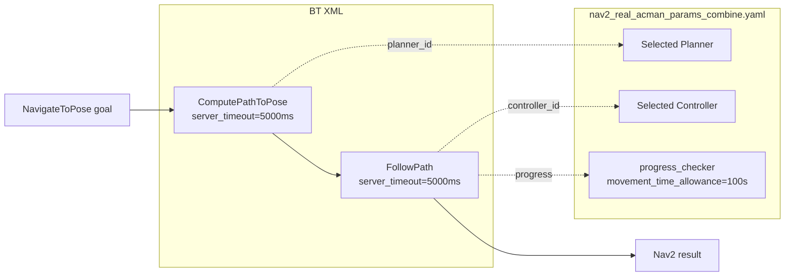
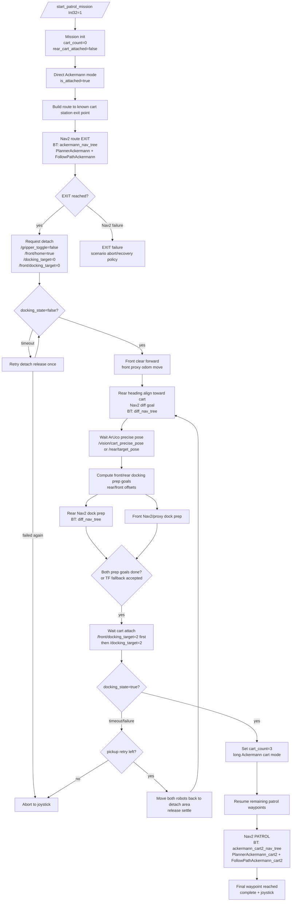
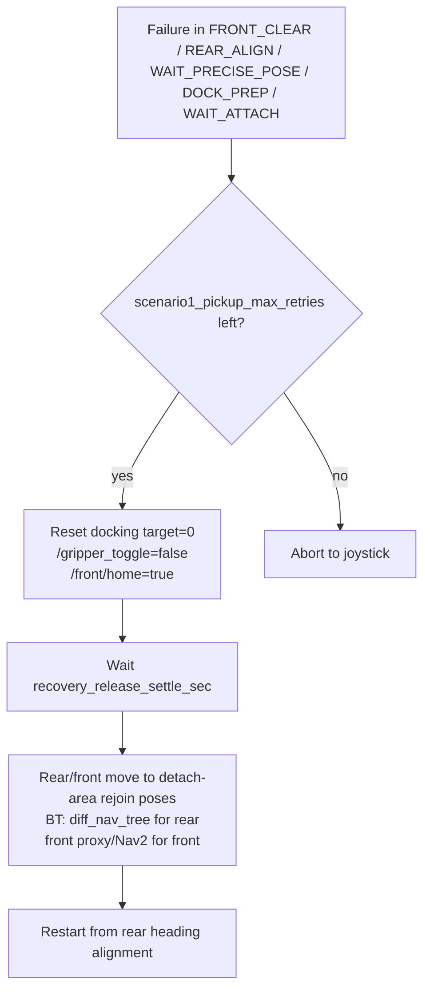
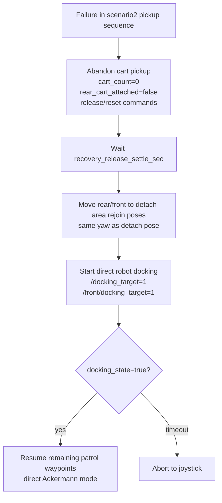
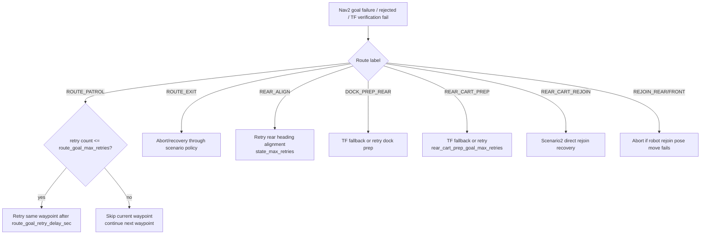

# Scenario Runner Flow

이 문서는 `scripts/scenario_runner.py` 기준의 시나리오 1/2 동작 흐름과 Nav2 사용 모드를 함께 정리한다.

## Nav2 Mode Map

`scenario_runner.py`는 현재 결합 상태에 따라 behavior tree와 velocity smoother 파라미터를 바꾼다.

| Runner state | Physical model | Behavior tree | Planner | Controller | Velocity mode |
|---|---|---|---|---|---|
| `is_attached=true`, `cart_count=0` | front+rear 직결 Ackermann | `ackermann_nav_tree.xml` | `PlannerAckermann` | `FollowPathAckermann` | ackermann direct |
| `is_attached=true`, `cart_count>=1` | cart 포함 long Ackermann | `ackermann_cart2_nav_tree.xml` | `PlannerAckermann_cart2` | `FollowPathAckermann_cart2` | ackermann cart |
| `is_attached=false`, `rear_cart_attached=false` | 개별 differential | `diff_nav_tree.xml` | `PlannerDiff` | `FollowPathDiff` | differential detached |
| `is_attached=false`, `rear_cart_attached=true` | rear+cart pull-out differential | `rear_cart_diff_nav_tree.xml` | `PlannerRearCartDiff` | `FollowPathRearCartDiff` | differential rear-cart |

모든 커스텀 BT는 동일한 구조다.

## Scenario 1

카트 수거장소의 global 위치는 이미 알고 있고, 실제 카트 자세는 ArUco 정밀 pose로 다시 잡는다. front/rear가 동시에 카트 앞뒤 접근 후 카트 묶음 3개를 포함한 long Ackermann으로 남은 waypoint를 돈다.

### Scenario 1 Recovery

## Scenario 2

카트 global 위치를 미리 모른다. patrol 중 vision global cart target이 들어오면 waypoint 경로상 이탈점까지 간 뒤, rear만 카트 손잡이 쪽으로 접근해 카트를 끌고 나온다. 이후 front가 추가 결합해서 cart 포함 Ackermann으로 남은 waypoint를 돈다.

```mermaid
flowchart TD
  S2Start[/start_patrol_mission Int32=2/] --> Init[Mission init<br/>cart_count=0<br/>rear_cart_attached=false]
  Init --> DirectMode[Direct Ackermann mode<br/>is_attached=true]
  DirectMode --> Patrol[Nav2 PATROL through waypoints<br/>BT: ackermann_nav_tree<br/>PlannerAckermann + FollowPathAckermann]

  Patrol --> Vision{Vision cart target?<br/>/zed_yolo/global_cart_target}
  Vision -- no --> Patrol
  Vision -- yes --> ExitPoint[Project cart to closest path point<br/>build EXIT route]
  ExitPoint --> NavExit[Nav2 route EXIT<br/>BT: ackermann_nav_tree]

  NavExit --> Detach[Request detach<br/>/gripper_toggle=false<br/>/front/home=true<br/>docking target reset]
  Detach --> DetachOK{docking_state=false?}
  DetachOK -- timeout --> DetachRetry[Retry detach release once]
  DetachRetry --> DetachOK
  DetachOK -- yes --> FrontClear[Front clear forward<br/>front_clear_distance]
  FrontClear --> FrontWait[Scenario2 extra front wait clear<br/>scenario2_front_wait_clear_distance]

  FrontWait --> RearAlign[Rear heading align toward detected cart<br/>BT: diff_nav_tree]
  RearAlign --> Precise[Wait ArUco precise pose]
  Precise --> RearCartPrep[Rear-only docking prep goal<br/>offset: rear_dock_goal_offset<br/>BT: diff_nav_tree]

  RearCartPrep --> RearRL[Start rear cart RL<br/>/docking_target=2]
  RearRL --> RearDone{rear rl_docking_done?}
  RearDone -- yes --> RearCartMode[rear_cart_attached=true<br/>differential rear-cart mode]
  RearDone -- timeout/failure --> DirectRejoin1[Abandon cart pickup<br/>direct robot rejoin recovery]

  RearCartMode --> GripSettle[Wait rear_cart_grip_settle_delay_sec]
  GripSettle --> RearReturn[Rear+cart returns near detach pose<br/>goal = detach pose - back_distance<br/>BT: rear_cart_diff_nav_tree<br/>PlannerRearCartDiff + FollowPathRearCartDiff]

  RearReturn --> FrontAttach[Front docking to cart/rear<br/>/front/docking_target=2]
  FrontAttach --> FrontAttachOK{docking_state=true?}
  FrontAttachOK -- yes --> CartAckermann[rear_cart_attached=false<br/>cart_count=1<br/>long Ackermann cart mode]
  FrontAttachOK -- timeout --> FrontRetry{front attach retry left?}
  FrontRetry -- yes --> FrontAttachReset[Reset front target=0<br/>/front/home=true<br/>retry /front/docking_target=2]
  FrontAttachReset --> FrontAttach
  FrontRetry -- no --> DirectRejoin2[Abandon cart pickup<br/>direct robot rejoin recovery]

  CartAckermann --> Resume[Resume remaining patrol waypoints]
  Resume --> NavCart[Nav2 PATROL<br/>BT: ackermann_cart2_nav_tree<br/>PlannerAckermann_cart2 + FollowPathAckermann_cart2]
  NavCart --> Done[Final waypoint reached<br/>complete + joystick]
```

### Scenario 2 Direct Rejoin Recovery

## Route Failure Policy

## Timeout Summary

| Step | Timeout / delay | Default |
|---|---|---|
| Detach wait | `detach_timeout_sec` | `12.0s` |
| Detach retry count | `detach_release_max_retries` | `1` |
| Precise ArUco pose wait | `precise_pose_timeout_sec` | `12.0s` |
| Scenario1 attach / rear-cart attach / robot rejoin attach | `attach_timeout_sec` | `180.0s` |
| Scenario2 final front attach | `scenario2_front_attach_timeout_sec` | `240.0s` |
| Scenario2 front attach retry count | `scenario2_front_attach_max_retries` | `1` |
| Rear cart grip settle | `rear_cart_grip_settle_delay_sec` | `3.0s` |
| Recovery release settle | `recovery_release_settle_sec` | `1.0s` |
| Front Nav/proxy result timeout | `front_goal_timeout_sec` | `30.0s` |
| Route TF fallback period | `route_tf_check_period_sec` | `0.5s` |
| Dock prep TF fallback period | `dock_prep_tf_check_period_sec` | `0.5s` |
